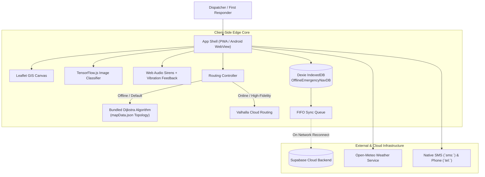

# Project Architecture & Codebase Analysis Report
**Project Name:** Kerala Emergency Dispatch (Vanguard Geo / `offline-emergency-nav`)  
**Target Environment:** Web PWA, Android (via Capacitor)  
**Date:** September 11, 2026  
**Status:** Operational / Production-Ready with Identified Optimization Targets

---

## 1. Executive Summary

**Kerala Emergency Dispatch** is an offline-first emergency coordination, incident reporting, and multi-modal navigation platform tailored for disaster response in Kerala, India. The application is architected to operate under severe network degradation or complete blackouts during monsoons, floods, and landslides.

It combines an on-device Dijkstra pathfinding engine over a bundled topological road network, a local-first IndexedDB database with offline synchronization queuing, edge AI photo classification for triage verification, and live integration with external services (Valhalla routing, Open-Meteo weather, and Supabase authentication).

---

## 2. Technical Stack Audit

| Dimension | Technology / Library | Version | Role in System |
| :--- | :--- | :--- | :--- |
| **Core UI Framework** | React | `19.2.7` | Modern declarative UI component tree |
| **Build & Bundling** | Vite | `8.1.1` | Lightning-fast ESM dev server and Rolldown/ESBuild compilation |
| **Mapping Engine** | Leaflet | `1.9.4` | Interactive GIS map, layers, coordinate projections, markers |
| **Offline Map Archives** | PMTiles | `4.5.0` | Serverless single-file tile archives with HTTP range requests |
| **Local Storage** | Dexie (IndexedDB) | `4.4.4` | Client-side reactive database schema & sync queue |
| **Edge AI / ML** | TensorFlow.js + MobileNet | `4.17.0` / `2.1.0` | Client-side zero-backend photo threat verification |
| **Cloud Backend & Auth** | Supabase JS | `2.115.0` | Admin console auth, session handling, cloud syncing |
| **Mobile Runtime** | Capacitor | `8.5.1` | Native Android wrapper & web-to-native hardware bridge |
| **Iconography & Polish** | Lucide React + Canvas Confetti | `1.23.0` / `1.9.4` | Tactical UI icons and achievement animations |
| **Code Linter** | Oxlint | `1.71.0` | Rust-powered high-speed static code analysis |

---

## 3. High-Level System Architecture



---

## 4. Key Subsystems & Core Capabilities

### 4.1. Offline Dijkstra Routing & Blockage Avoidance
* **Bundled Topology (`mapData.json`)**: Contains 19 key Kerala nodes (Thiruvananthapuram, Kochi, Kozhikode, Thrissur, Palakkad, Wayanad, Munnar, etc.) and bidirectional road edges with coordinate geometries.
* **Dynamic Cost & Speed Calculations**:
  * Car: Base speed 85 km/h; adjusted on ghat roads (Idukki, Munnar capped at 35 km/h) and local links (45 km/h).
  * Bus: Base speed 55 km/h.
  * Walk: 5 km/h.
* **Blockage Rerouting**: Actively excludes edges flagged with landslides, fallen trees, or flooding. If a path is blocked, Dijkstra calculates an alternate detour instantaneously.
* **Voice Navigation**: Spoken turn-by-turn guidance synthesized via HTML5 `SpeechSynthesis`.

### 4.2. Incident Management & Automated Dispatch
* **Emergency Types**: Flood, Fire/Landslide, Medical Emergency, Traffic Blockage.
* **Priority Tiers**: Critical, High, Medium, Low.
* **Responder Fleet**: Units (Ambulance Alpha, Fire Engine Beta, Rescue Boat Gamma) with live coordinates, status flags (`idle`, `dispatched`, `en_route`), and simulated polyline movement along calculated routes.
* **Sensory Warnings**: Dual-tone Web Audio frequency sirens and haptic vibration patterns (`navigator.vibrate`) on mobile devices.

### 4.3. Client-Side AI Photo Verification
* Dynamically loads `@tensorflow/tfjs` and `@tensorflow-models/mobilenet`.
* Evaluates user-submitted disaster photographs directly in the browser against threat keywords:
  * **Flood**: `flood`, `river`, `stream`, `canal`, `waterfall`, `dam`
  * **Landslide**: `landslide`, `rockslide`, `mudslide`, `debris`, `boulder`, `cliff`, `mountain`
  * **Fire**: `fire`, `flame`, `smoke`, `blaze`
  * **Medical / Crash**: `ambulance`, `crash`, `wreck`, `collision`, `stretcher`
* Protects against fake incident filings before triggering first responder units.

### 4.4. Live Meteorological Hazard Engine
* Queries Open-Meteo coordinates API for temperature, humidity, wind speeds, and rain probability.
* Categorizes threats into `danger`, `caution`, or `safe`.
* Dynamically renders animated HTML5 Canvas overlays (rain particle physics, lightning flashes, fog) directly on the Leaflet viewport.

### 4.5. Evacuation Safe Hubs & Transit Logistics
* **Shelters Manager**: Tracks designated relief camps across Kerala districts, monitoring total capacity, live occupancy percentages, and inventory of food, clean water, medical packs, and blankets.
* **Bus Fleet ("Bustle")**: Real-time monitor of public and private bus lines across Kerala with station progression tracking.

### 4.6. Emergency SOS & Direct Calling
* Pre-configured hotlines: Police (`100`), Fire (`101`), Medical (`108`), Disaster Management (`112`).
* Emergency contacts stored locally with one-tap SMS dispatch formatting location coordinates into Google Maps links.

---

## 5. Codebase Health, Bugs & Technical Debt

### 5.1. Critical Bug in Service Worker (`public/sw.js:23`)
> [!CAUTION]
> In [`public/sw.js`](file:///c:/Users/ADMIN/Downloads/Emergency-Dispatch/public/sw.js#L23), line 23 references `request` instead of `event.request`:
> ```javascript
> const isPmtilesRangeRequest = request.headers.has('range') && ...
> ```
> This causes an uncaught `ReferenceError: request is not defined` whenever a fetch event executes this check, breaking offline handling for range requests.
> **Fix**: Change `request.headers` to `event.request.headers`.

### 5.2. Monolithic Architecture in `App.jsx`
> [!WARNING]
> [`src/App.jsx`](file:///c:/Users/ADMIN/Downloads/Emergency-Dispatch/src/App.jsx) is **5,433 lines long** with over 50 state variables.
> All business logic, map rendering, modals, audio synthesis, customer tracking, business directory, and admin panels reside in a single component.
> **Recommendation**: Break into modular subcomponents:
> - `src/components/map/`
> - `src/components/dispatch/`
> - `src/components/navigation/`
> - `src/components/shelters/`
> - `src/hooks/` (`useDijkstra`, `useAudioAlerts`, `useWeather`)

### 5.3. Bundle Size & Code Splitting
* Current single output chunk is **858 kB** (248 kB gzip).
* Heavy secondary views (Business Directory, Evacuation Shelters, Admin Console, and TensorFlow.js dependencies) should be lazy-loaded using `React.lazy()` and `Suspense`.

### 5.4. Offline Model Availability
* TensorFlow.js and MobileNet are loaded via external CDN (`cdn.jsdelivr.net`).
* In true zero-connectivity disaster zones, new users cannot download the model. The model files should be packaged locally in the PWA cache if offline verification is mandatory.

---

## 6. Verification Status

* **Build Test (`npm run build`)**: Passed successfully in ~400ms.
* **Linter (`oxlint`)**: 0 errors, 19 minor warnings (unused imports/variables and hook dependencies).
* **Native Packaging**: Android project scaffolded and configured via `@capacitor/android`.
